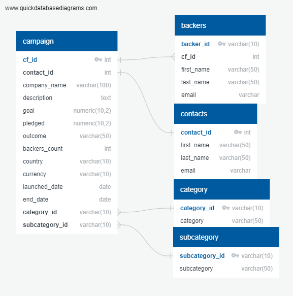

# Crowdfunding ETL with PostgreSQL

Independent Funding is a crowdfunding platform for funding independent projects or ventures. We created a database for them that included information about the campaigns, a category and subcategory lookup table, and contact information for the person who runs the campaign. The company decided it wanted another table that included the information about backers who've pledged to the live projects. Our first goal was to create an ERD and an empty table for the backers with the proper columns, data types, and connections in our database. Then we extracted the data from our data source (in this case a csv), transformed it using python and pandas, and once saved as a csv it was loaded into our database. Last, we performed an analysis using SQL queries to get the number of backers for each live campaign, as well as get the contact info for organizers and backers of each live campaign with the remaining goal amount. These were saved as email_contacts_remaining_goal_amount.csv and email_backers_remaining_goal_amount.csv. 

